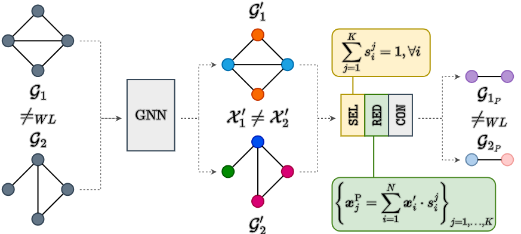
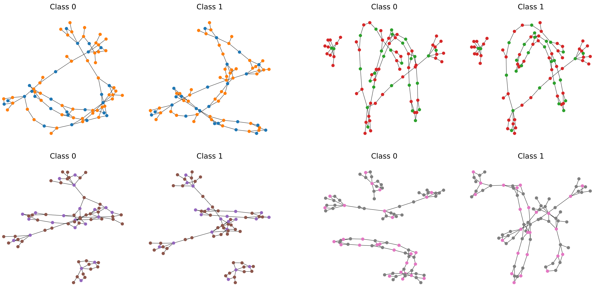

[](https://neurips.cc/virtual/2023/poster/69873)
[](https://arxiv.org/abs/2304.01575)
[](https://github.com/FilippoMB/The-expressive-power-of-pooling-in-GNNs/tree/main/figs/GNN_pool_expressiveness.pdf)
[](https://youtu.be/YNg2FSm1zdI)

Official repository of the paper *"The expressive power of pooling in Graph Neural Networks"* by F. M. Bianchi and V. Lachi presented at NeurIPS 2023.

In a nutshell, a graph pooling operator can be expressed as the composition of 3 functions:

- $\texttt{SEL}$: defines how to form the vertices of the coarsened graph;
- $\texttt{RED}$: computes the vertex features in the coarsened graph;
- $\texttt{CON}$: computes the edges in the coarsened graphs.

More details about the Select-Reduce-Connect framework can be found [here](https://github.com/danielegrattarola/SRC).

If certain conditions are met on the GNN layers before pooling, on the $\texttt{SEL}$, and on the $\texttt{RED}$ functions, then enough information is preserved in the coarsened graph.
In particular, if two graphs $\mathcal{G}_ 1$ and $\mathcal{G}_ 2$ are WL-distinguishable, their coarsened versions $\mathcal{G}_ {1_P}$ and $\mathcal{G}_{2_P}$ will also be WL-dinstinguishable.



This repository contains the EXPWL1 dataset and the code to test empirically the expressivity of existing graph pooling operators, which is their ability to generate coarsened graphs that are still distinguishable.

### Execution
Run ````python main.py --pooling 'method'```` to perform graph classification on the EXPWL1 dataset, where ````'method'```` can be one of the following:

````python 
None, 'diffpool', 'mincut', 'dmon', 'edgepool', 'graclus', 'kmis', 'topk', 'panpool', 
'asapool', 'sagpool', 'dense-random', 'sparse-random', 'comp-graclus'
````

The code is based on [Pytorch Geometric](https://pytorch-geometric.readthedocs.io/) and was tested on:
- torch v2.0.0
- torch_geometric v2.3.0

### The EXPWL1 dataset
The dataset contains 1500 pairs of graphs $(\mathcal{G}_i, \mathcal{H_i})$, which are non-isomorphic and WL-1 distinguishable.
A GNN should achieve approximately 100\% accuracy on this dataset if it is as powerful as the WL-1 test .
Four of the graph pairs in the dataset are displayed below.



The dataset can be downloaded [here](https://github.com/FilippoMB/The-expressive-power-of-pooling-in-GNNs/tree/main/data/EXPWL1) and the Pytorch Geometric loader is in [utils.py](https://github.com/FilippoMB/The-expressive-power-of-pooling-in-GNNs/blob/0a25de158c336acab697398951d6d3a0fec1c6cf/scripts/utils.py#L30).

### Citation

Please, consider citing our paper if you use this code or EXPWL1 dataset in your research:

````bibtex
@article{bianchi2023expressive,
  title={The expressive power of pooling in Graph Neural Networks},
  author={Filippo Maria Bianchi and Veronica Lachi},
  journal={Advances in neural information processing systems},
  volume={36},
  year={2023}
}
````
