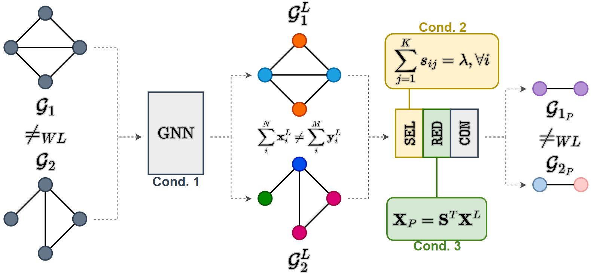

Official repository of the paper [The expressive power of pooling in Graph Neural Networks](https://arxiv.org/abs/2304.01575).




### Execution
Run ````python main.py --pooling 'method'```` to perform graph classification on the EXPWL1 dataset, where ````'method'```` can be one of the following:

````python 
None, 'diffpool', 'mincut', 'dmon', 'edgepool', 'graclus', 'kmis', 'topk', 'panpool', 
'asapool', 'sagpool', 'dense-random', 'sparse-random', 'comp-graclus'
````

The code is based on [Pytorch Geometric](https://pytorch-geometric.readthedocs.io/) and was tested on:
- torch v2.0.0
- torch_geometric v2.3.0

### The EXPWL1 dataset
The dataset contains 1500 pairs of graphs $(\mathcal{G}_i, \mathcal{H_i})$, which are non-isomorphic and WL-1 distinguishable.
A GNN as powerful as the WL-1 test should achieve approximately 100\% accuracy on this dataset.
Two of the graph pairs in the dataset are displayed below.

---


---


---

The dataset can be downloaded [here](https://github.com/FilippoMB/The-expressive-power-of-pooling-in-GNNs/tree/main/data/EXPWL1) and loaded in Pytorch Geometric format using the loader in [utils.py](https://github.com/FilippoMB/The-expressive-power-of-pooling-in-GNNs/blob/0a25de158c336acab697398951d6d3a0fec1c6cf/scripts/utils.py#L30).

### Citation

Please, consider citing our paper if you use this code or the dataset in your research.

    @misc{bianchi2023expressive,
          title={The expressive power of pooling in Graph Neural Networks}, 
          author={Filippo Maria Bianchi and Veronica Lachi},
          year={2023},
          eprint={2304.01575},
          archivePrefix={arXiv},
          primaryClass={cs.LG}
    }
